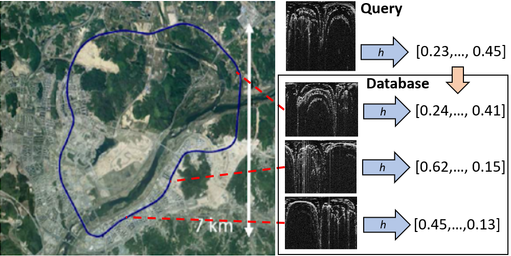

# Large-Scale Topological Radar Localization Using Learned Descriptors

Paper: [Large-Scale Topological Radar Localization Using Learned Descriptors](http://arxiv.org/xxxxxxx) 

[Jacek Komorowski](mailto:jacek.komorowski@pw.edu.pl), Monika Wysoczanska, Tomasz Trzcinski

Warsaw University of Technology

### Introduction
This work proposes a method for large-scale topological localization based on radar scan images using learned descriptors.
We present a simple yet efficient deep network architecture to compute a rotationally invariant discriminative global descriptor from a radar
scan image. The performance and generalization ability of the proposed method is experimentally evaluated on two large scale driving datasets:
MulRan and Oxford Radar RobotCar. Additionally, we present a comparative evaluation of radar-based and LiDAR-based localization using
learned global descriptors.

## Training and evaluation code and pre-trained models will be released after the paper acceptance.
