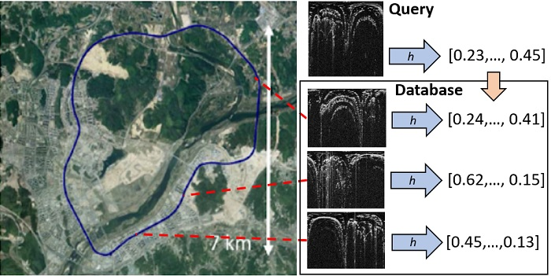

# RadarLoc: Large-Scale Topological Radar Localization Using Learned Descriptors

Paper: [Large-Scale Topological Radar Localization Using Learned Descriptors](https://link.springer.com/chapter/10.1007/978-3-030-92270-2_39) 
accepted for 2021 International Conference on Neural Information Processing (ICONIP)
[arXiv](https://arxiv.org/pdf/2110.03081.pdf)

[Jacek Komorowski](mailto:jacek.komorowski@pw.edu.pl), Monika Wysoczanska, Tomasz Trzcinski

Warsaw University of Technology

### What's new ###
* [2021-10-09] Code and pre-trained models released. 

### Our other projects ###
* MinkLoc3D: MinkLoc3D: Point Cloud Based Large-Scale Place Recognition (WACV 2021): [MinkLoc3D](https://github.com/jac99/MinkLoc3D) 
* MinkLoc++: Lidar and Monocular Image Fusion for Place Recognition (IJCNN 2021): [MinkLoc++](https://github.com/jac99/MinkLocMultimodal)
* EgonNN: Egocentric Neural Network for Point Cloud Based 6DoF Relocalization at the City Scale (IEEE Robotics and Automation Letters April 2022): [EgoNN](https://github.com/jac99/Egonn) 
* Improving Point Cloud Based Place Recognition with Ranking-based Loss and Large Batch Training (2022): [MinkLoc3Dv2](https://github.com/jac99/MinkLoc3Dv2) 


### Introduction
This work proposes a method for **large-scale topological localization based on radar scan images** using learned 
descriptors. We present a simple yet efficient deep network architecture to compute a rotationally invariant 
discriminative global descriptor from a radar scan image. The performance and generalization ability of the 
proposed method is experimentally evaluated on two large scale driving datasets: MulRan and Oxford Radar RobotCar. 
Additionally, we present a comparative evaluation of radar-based and LiDAR-based localization using learned global descriptors.



### Citation
If you find this work useful, please consider citing:

    @inproceedings{komorowski2021large,
    title={Large-Scale Topological Radar Localization Using Learned Descriptors},
    author={Komorowski, Jacek and Wysoczanska, Monika and Trzcinski, Tomasz},
    booktitle={International Conference on Neural Information Processing},
    pages={451--462},
    year={2021},
    organization={Springer}
    }

### Environment and Dependencies
Code was tested using Python 3.8 with PyTorch 1.9.1 and MinkowskiEngine 0.5.4 on Ubuntu 20.04 with CUDA 10.2.
Note: CUDA 11.1 is not recommended as there are some issues with MinkowskiEngine 0.5.4 on CUDA 11.1. 

The following Python packages are required:
* PyTorch (version 1.9.1)
* MinkowskiEngine (version 0.5.4)
* pytorch_metric_learning (version 1.0 or above)
* wandb

Modify the `PYTHONPATH` environment variable to include absolute path to the project root folder: 
```export PYTHONPATH
export PYTHONPATH=$PYTHONPATH:/home/.../RadarLoc
```

### Datasets

**RadarLoc** is trained and evaluated using the following datasets:
* MulRan dataset: Sejong traversal is split into training and evaluation part, KAIST and Riverside traversals are used
 for evaluation [link](https://sites.google.com/view/mulran-pr)
* Oxford Radar RobotCar dataset: sequences 2019-01-15-13-06-37-radar-oxford-10k and 2019-01-18-14-14-42-radar-oxford-10k
are used for evaluation [link](https://oxford-robotics-institute.github.io/radar-robotcar-dataset)

First, you need to download datasets:

* For MulRan dataset you need to download ground truth data (*.csv), radar scan images (polar.zip) and 
(optionally) LiDAR point clouds (Ouster.zip) for traversals: Sejong01, Sejong02, KAIST01, KAIST02, Riverside01, Riverside02. 
Use this [link](https://sites.google.com/view/mulran-pr/download).
* For Oxford Radar RobotCar you need to download ground truth (ins.csv) radar scan images and
(optionally) LiDAR point clouds (velodyne_left) for traversals: 
2019-01-15-13-06-37-radar-oxford-10k and 2019-01-18-14-14-42-radar-oxford-10k.
Use this [link](https://oxford-robotics-institute.github.io/radar-robotcar-dataset/downloads#download-script).

LiDAR point clouds are needed only if you want to train or evaluate point cloud-based descriptor. 
For radar-based descriptor (RadarLoc), point clouds are not needed.

After loading datasets you need to:
1. **Generate downsampled radar scan images** for training/evaluation of our RadarLoc method (scans are downsampled to 384x128 resolution)
and for evaluation of ScanContext method (scans are downsampled to 120x40 resolution). 
Run `python downsample_radar_scans.py --dataset_root <dataset_root_path> --dataset <mulran|robotcar>` script in `scripts` folder. 
Run the script twice to process two datasets (MulRan and Radar RobotCar). 
Downsampled radar scans will be saved as .png images in *polar_384_128* and *polar_120_40* subfolders in each traversal.
2. **Generate training pickles** needed for the network training. These pickles are based on a training split of 
Sejong01 and Sejong02 traversals in MulRan dataset.
Run `python generate_training_tuples.py --dataset_root <mulran_dataset_root_path>` script in *datasets/mulran* folder. Use default values for 
other parameters. It'll create training data in the dataset root folder for training radar-based RadarLoc descriptor (*train_R_Sejong01_Sejong02_5_20.pickle*, *val_R_Sejong01_Sejong02_5_20.pickle*)
and LiDAR-based descriptor (*train_L_Sejong01_Sejong02_5_20.pickle*, *val_L_Sejong01_Sejong02_5_20.pickle*).
The pickles contain lists of positives (similar locations) and non-negatives for each sensor reading (radar scan or LiDAR point cloud).
3. **Generate evaluation pickles** for model evaluation. 
Run `python generate_evaluation_sets.py --dataset_root <dataset_root_path>` script from *datasets/mulran* and *datasets/robotcar_radar*
to generate evaluation data for each dataset. Use default values for other parameters. Evaluation pickles will be saved
in the dataset root folder in *test_xxxxxxxxxx.pickle* files.

### Training
The training procedure for radar-based **RadarLoc** model and LiDAR-based **MinkLoc** model is similar.
First, download datasets and generate training and evaluation pickles as described above.
Edit the configuration file (*config_radarloc.txt* or *config_minkloc.txt*). 
Set *dataset_folder* parameter to point to the dataset root folder.
Modify *batch_size_limit* parameter depending on available GPU memory. 
Default limit (=64) in *config_minkloc.txt* for LiDAR-based model requires at least 11GB of GPU RAM.

To train the network, run:

```
cd training

# Train radar-based RadarLoc model
python train.py --config ../config/config_radarloc.txt --model_config ../models/radarloc.txt 

# Train lidar-based MinkLoc model
python train.py --config ../config/config_minkloc.txt --model_config ../models/minkloc.txt
```

### Pre-trained Models

Pretrained models are available in *weights* directory
- *radarloc.pth* radar-based RadarLoc model 
- *minkloc.pth* LiDAR-based MinkLoc model 

### Evaluation

To evaluate pretrained models run the following commands:

```
cd eval

# Evaluate radar-based RadarLoc model
python evaluate.py --dataset_root <dataset_root_path> --dataset <mulran|robotcar> --sensor R --model_config ../models/radarloc.txt --weights ../weights/radarloc.pth

# Evaluate lidar-based MinkLoc model
python evaluate.py --dataset_root <dataset_root_path> --dataset <mulran|robotcar> --sensor L --model_config ../models/minkloc.txt  --weights ../weights/minkloc.pth
```
To run evaluation with random rotations of sensor readings (to verify rotational invariance of the learned descriptor)
use *with_rotation* parameter.

## Results

**RadarLoc** (*radarloc.pth*) performance, measured by Average Recall@1 with **5m. threshold**.

| Method         | Sejong | KAIST | Riverside | Radar RobotCar |
| ------------------ |---------------- | -------------- |---|---|
| Ring key [1] |     0.503     |   0.805 | 0.497 | 0.747 |
| ScanContext [1] |     0.868     |   0.935 | 0.671 | 0.906 |
| VGG-16/NetVLAD |     0.789     |   0.885 | 0.613 | 0.883 |
| **RadarLoc (our)**  |     **0.929**     |   **0.959** | **0.744** | **0.949** |


**RadarLoc** (*radarloc.pth*) performance, measured by Average Recall@1 with **10m. threshold**.

| Method         | Sejong | KAIST | Riverside | Radar RobotCar |
| ------------------ |---------------- | -------------- |---|---|
| Ring key [1] |     0.594     |   0.848 | 0.595 | 0.786 |
| ScanContext [1] |     0.879     |   0.946 | 0.772 | 0.933 |
| VGG-16/NetVLAD |     0.938     |   0.937 | 0.834 | 0.939 |
| **RadarLoc (our)**  | **0.988**  | **0.988** | **0.923** | **0.981** |

1. G. Kim, A. Kim, "Scan context: Egocentric spatial descriptor for place recognition within 3d point cloud map", 2018 IEEE/RSJ International Conference on Intelligent Robots and Systems (IROS)

### Comparison of radar-based (RadarLoc) and LiDAR-based (MinkLoc) topological localization. 
Below table shows Average Recall@1 with 10m. threshold.

LiDAR-based model (MinkLoc) is an improved version of our previous MinkLoc3D model [(MinkLoc3D)](https://github.com/jac99/MinkLoc3D),
optimized for larger point clouds from a rotating 3D LiDAR. The model depth is increased and 
channel attention mechanism (Efficient Channel Attention) is added.

| Method         | Sejong | KAIST | Riverside | 
| ------------------ |---------------- | -------------- |---|
| RadarLoc (*radarloc.pth*) | 0.988  | 0.988 | 0.923 |
| MinkLoc (*minkloc.pth*) | 0.986 |  0.929  | 0.872 |

### License
Our code is released under the MIT License (see LICENSE file for details).
